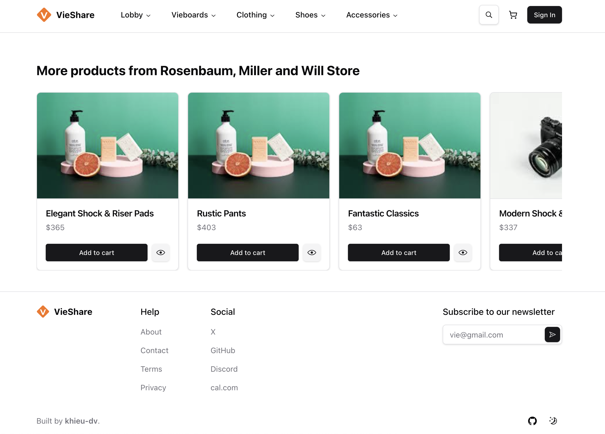

# vieshare - E-commerce Platform

This is an open-source e-commerce platform for a vieshare, built with Next.js and PocketBase.

<p align="center">
  
  
</p>

<p align="center">
  
  
</p>

> **Warning**
> This project is still in development and is not ready for production use.

## Tech Stack

- **Framework:** [Next.js](https://nextjs.org)
- **Styling:** [Tailwind CSS](https://tailwindcss.com)
- **Database & Auth:** [PocketBase](https://pocketbase.io)
- **UI Components:** [shadcn/ui](https://ui.shadcn.com)
- **Content Management:** [Contentlayer](https://www.contentlayer.dev)
- **File Uploads:** [uploadthing](https://uploadthing.com)

## Features

- User authentication with PocketBase
- Storefront with products, categories, and subcategories
- "More products from" section on product detail page
- Product image carousel
- Shopping cart
- ... and more to come!

## Running Locally

1.  **Clone the repository**

    ```bash
    git clone https://github.com/khieu-dv/vieshare
    ```

2.  **Install dependencies**

    ```bash
    pnpm install
    ```

3.  **Set up PocketBase**

```bash
cd pocketbase-docker
docker-compose up -d
```

**🔗 PocketBase Admin**: http://localhost:8090/_/
- Set up your admin account and configure collections
- The database will be automatically seeded with demo content

4.  **Set up environment variables**

    Copy the `.env.example` file to a new file named `.env` and update the variables with your PocketBase API URL.

    ```bash
    cp .env.example .env
    ```

    Your `.env` file should look like this:

    ```
    NEXT_PUBLIC_POCKETBASE_URL=http://127.0.0.1:8090
    ```

5.  **Run the database migrations**

    This project uses a migration tool to manage the PocketBase schema. To apply the migrations, run the following command:

    ```bash
    node import-fake-data.js
    ```

    This will create the necessary collections and fields in your PocketBase project. You can view the schema in the `pocketbase-schema.md` file.

6.  **Start the development server**

    ```bash
    pnpm run dev
    ```

    The application will be available at `http://localhost:3000`.

## Contributing

Contributions are welcome! Please open an issue if you have any questions or suggestions. Your contributions will be acknowledged. See the [contributing guide](./CONTRIBUTING.md) for more information.

## License

Licensed under the MIT License. Check the [LICENSE](./LICENSE.md) file for details.